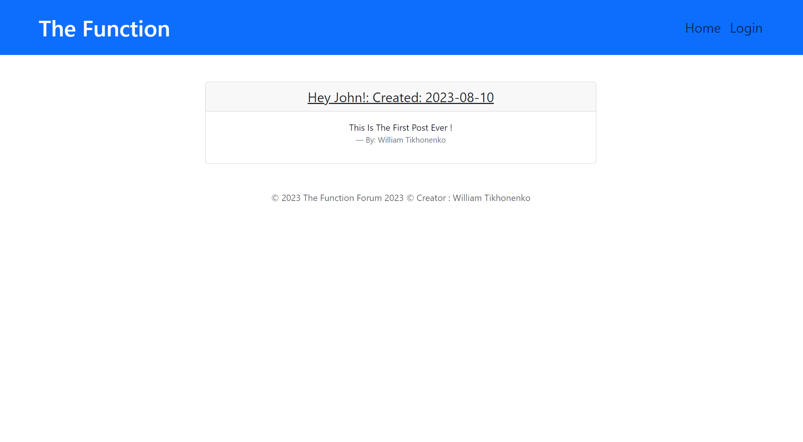

# The Function - A Tech Blog

Welcome to The Function - A Tech Blog! This project is a web application where you can explore the latest tech trends, read informative articles, and stay up to date with the ever-evolving world of technology.


link included here
https://whispering-everglades-98902-1ba343f0f56f.herokuapp.com/


## Table of Contents


- [Installation](#installation)
- [Usage](#usage)
- [Contributing](#contributing)
- [Tests](#tests)
- [Credits](#credits)
- [Licenses](#licenses)
- [Questions](#questions)

## Getting Started

To get started with The Function, follow these steps:

### Prerequisites

- Node.js (Download and install from [https://nodejs.org/](https://nodejs.org/))
- MySQL (Download and install from [https://dev.mysql.com/downloads/](https://dev.mysql.com/downloads/))

### Installation

1. Clone the repository:

   ```sh
   git clone https://github.com/WillZealot/Tech-Blog

2.   open it up and do (npm i).

3. Create a .env file in the project root you do have an example env that serves as a template

4. In your terminal run (mysql -u root -p) then do (source db/schema.sql;) and after that do (quit;)

5. in your terminal run (npm run seed)

6. in your terminal run (npm start)

7. in browser or insomnia go to http://localhost:3001 and you should see the function blog. you can log in and sign up.

## Usage
"The Function" serves as both a tech blog and a forum platform. Users can access a collection of informative articles and tutorials on various tech topics. Additionally, they can actively engage with the community by participating in forum discussions, sharing their thoughts, and contributing their own posts.

## Technologies Used

Handlebars.js
JavaScript
CSS
MySQL
Sequelize
Express.js
Dependencies:

bcrypt
bcryptjs
connect-session-sequelize
dotenv
express-handlebars
express-session
mysql2
sequelize

## Credits
William Tikhonenko

## Contributing


## Tests
None

## Licenses


## Questions
https://github.com/WillZealot
williamtikhonenko@gmail.com